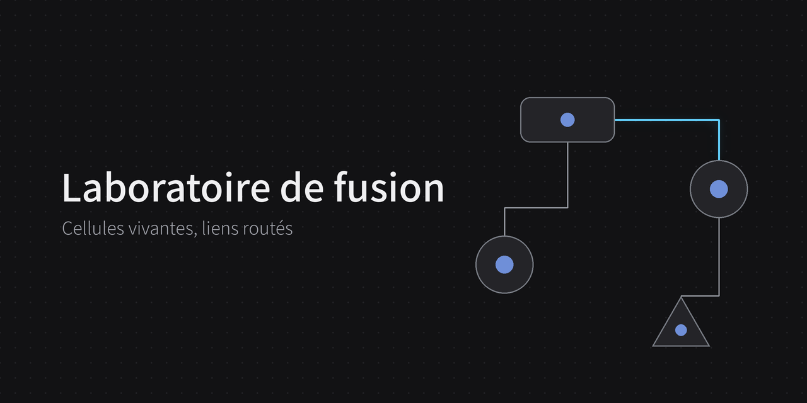

# Laboratoire de fusion

Des cellules vivantes, dessinées à main levée, reliées par des liens de filiation routés en orthogonal. Chaque cellule est une membrane souple qui ondule, réagit aux gestes et transmet ses propriétés à sa descendance. On y écrit au clavier, ou à la main : le mot manuscrit glissé dans une cellule s'y dissout et devient du texte. Une goutte de pigment la teint, des pétales règlent la typographie, la taille et le style de son texte.

Page autonome, sans installation : ouvrir `index.html` dans un navigateur, ou la version en ligne sur GitHub Pages. Fonctionne à la souris, au doigt et au stylet, sur ordinateur, iPad et iPhone. La toile est infinie : on y zoome et on s'y déplace à deux doigts, à la molette ou au pavé.

## Gestes en bref

| Geste | Effet |
| --- | --- |
| Dessiner une forme sur le fond | Crée une cellule de cette forme |
| Appui simple sur une cellule | Allume sa lignée et ouvre la saisie ; au stylet, une fois passé le double appui possible |
| Double appui sur une cellule | Fait naître une fille de la même forme ; au doigt ou à la souris, son champ de texte s'ouvre |
| Bouton stylet, ou stylet maintenu sur le fond | Ouvre ou ferme l'écriture à la main |
| Appui maintenu sur un mot manuscrit, puis glisser | Le dépose dans une cellule, où il devient du texte |
| Tirer depuis le bord d'une cellule | Relie une mère à sa fille |
| Glisser l'intérieur | Déplace la cellule |
| Appui long | Met la cellule en mode tremblement |
| Glisser une cellule qui tremble | Déplace toute sa lignée |
| Appui sur une autre cellule (mode tremblement) | Lui donne la taille de la cellule qui tremble |
| Glisser une autre cellule (mode tremblement) | L'aligne sur l'axe horizontal ou vertical de la cellule qui tremble |
| Tirer les marques de rotation (mode tremblement) | Fait tourner la cellule |
| Appui sur une bille (mode tremblement) | Déplie ou replie ses choix : couleur, typographie, taille ou style |
| Appui sur une goutte | Teint la cellule et sa lignée ; la goutte d'eau lave le pigment |
| Appui sur un pétale | Change la typographie, la taille ou le style du texte |
| Appui sur l'encoche d'une mère | Replie ou déplie ses filles |
| Trait en travers d'un lien | Coupe le lien |
| Croix ou rature sur une cellule | Supprime la cellule |
| Croix sur un mot manuscrit | Efface le mot |
| Pincer à deux doigts | Zoome, de 25 % à 400 % |
| Glisser à deux doigts | Déplace la vue |
| Molette, ou pavé à deux doigts (ordinateur) | Déplace la vue ; avec Ctrl ou Cmd, ou en pinçant le pavé, zoome |
| Appui sur la pastille du zoom | Passe de 100 % à « tout voir », et inversement |

## Créer une cellule

### En dessinant

Tracer une forme fermée sur le fond, d'un seul geste. Le tracé est reconnu, puis remplacé par une cellule de la forme correspondante. L'octogone n'en fait pas partie : trop proche du rond, il le faisait mal reconnaître ; un octogone dessiné devient un rond ou un hexagone.

Formes reconnues :

- rond et ovale ;
- rectangle, qui devient un carré s'il en est proche ;
- triangle ;
- losange, pentagone, hexagone ;
- étoile ;
- cœur, pointe en bas ;
- nuage, avec autant de bosses que dessinées ;
- flèche.

Comme dans un logiciel de dessin, la forme est redressée en **forme standard** :

- un triangle proche de l'équilatéral, du rectangle ou de l'isocèle le devient ;
- les polygones et l'étoile sont réguliers et homothétiques, avec des branches de même longueur pour l'étoile ;
- le cœur prend des proportions standard, et les garde quand il change de taille ;
- une forme presque droite est remise d'aplomb.

La **flèche** se dessine de trois façons :

- en contour, comme une forme fermée ;
- d'un seul geste : la hampe, puis la pointe en V ;
- en deux traits : la hampe, puis la pointe posée sur l'un de ses bouts, dans les 3 secondes. Le trait droit reste affiché en attendant sa pointe, puis s'efface s'il n'en reçoit pas.

### Par bourgeonnement

Un **double appui** sur une cellule, au doigt, au stylet ou à la souris, fait naître une fille. Le second appui doit suivre le premier de moins d'une demi-seconde ; il peut tomber un peu à côté, sur le bord ou juste hors de la membrane, et la paume posée sur l'écran ne le bloque pas. Elle sort de la membrane de sa mère, grandit, dépasse légèrement sa place puis s'y pose. Le lien qui les unit s'allume au passage.

- La fille reprend la forme de sa mère : même type, même taille, même orientation et même teinte.
- La première fille se place à côté de la mère, à droite, ou à gauche s'il n'y a pas la place.
- Les suivantes se rangent sous la sœur la plus basse, en colonne.
- Une mère dont la famille est repliée la déplie d'abord.
- Au doigt ou à la souris, le champ de saisie s'ouvre sur la fille : on peut taper son texte aussitôt. Au stylet, rien ne s'ouvre, pour que le double appui reste net.
- Le double appui fonctionne à tous les zooms : le champ ouvert par le premier appui laisse passer le second jusqu'à la cellule, au doigt comme au stylet.

## Écrire dans les cellules

### Au clavier

Un appui simple sur une cellule ouvre un champ posé sur elle, dans la même typographie que le texte affiché. **Entrée** valide, **Maj + Entrée** va à la ligne, et un appui hors de la cellule, même tout près de son bord, valide aussi et referme la saisie.

- **Au stylet**, le champ s'ouvre une demi-seconde après l'appui, une fois écarté le double appui : on y écrit à la main grâce au Griffonnage d'iPadOS, ou au clavier.
- **Double appui** : pendant la demi-seconde qui suit l'ouverture, le champ laisse passer un second appui jusqu'à la cellule, qui fait naître une fille.
- **Vue de loin** : si le texte ferait moins de 11 px à l'écran, la vue revient à 100 %, la cellule en haut de l'écran, au-dessus du clavier.

Le texte se cale dans la forme. S'il déborde, sa taille diminue jusqu'à 12 px, puis la cellule grandit juste assez pour le contenir ; au-delà, la dernière ligne visible se termine par des points de suspension. Une cellule écrite perd son noyau et prend une légère teinte.

### À la main

1. **Ouvrir l'écriture libre** : bouton stylet de la barre, ou appui long du stylet sur le fond (le bouton latéral du crayon n'est pas transmis aux pages web). Le même geste la referme.
2. **Écrire n'importe où** sur la page. Les traits proches, écrits à la suite, forment un mot ; un point sur un i ou une barre de t rejoint le mot qu'il touche.
3. **Refermer l'écriture libre** (même geste qu'à l'ouverture) : tout ce qui a été écrit pendant la séance forme un seul bloc, qui pulse légèrement, et se glisse d'un geste. Un bloc d'une séance précédente reste à part, et un mot effacé n'en fait pas partie. Pendant la séance, chaque mot peut encore être glissé seul.
4. **Glisser le mot** : appui maintenu sur le mot, il se soulève, puis le glisser. La cellule visée s'éclaire. Hors écriture libre, le mot part dès qu'on le glisse.
5. **Lâcher** : sur une cellule, le mot y entre ; sur le fond, il reste là ; au bord de la page, il est jeté.

**Écrire une liste.** Commencer chaque ligne par une pastille (un point, un petit rond) ou par un tiret. Une pastille ou un tiret posé sous le mot, aligné sur son bord gauche, dans les 2,5 secondes, rattache la ligne au même mot : toute la liste se glisse d'un geste. À la lecture, chaque ligne écrite devient une ligne du texte ; une pastille ou un tiret repéré en tête de ligne devient « • » ou « – ». Dans la cellule, un texte de plusieurs lignes ou une liste commence sur une nouvelle ligne ; une liste s'affiche alignée à gauche, en bloc centré ; le champ de saisie au clavier suit la même mise en page.

**Effacer un mot** qu'on ne veut pas garder : une croix dessus, deux traits droits qui se coupent sur le mot, le second dans les 3 secondes. Le mot se contracte et s'efface. En écriture libre, chaque trait doit barrer le mot sur au moins la moitié de sa diagonale, ce qu'une lettre comme un t ou un x n'atteint pas. Hors écriture, commencer le premier trait à côté de l'encre : un trait qui part du mot le saisit pour le glisser.

### La lecture

Lâché dans une cellule, le mot se défait en gouttelettes d'encre qui entrent dans la membrane, s'y diffusent en tournoyant et prennent sa teinte, pendant qu'une onde lente fait le tour de la cellule. Le texte lu s'ajoute à celui de la cellule : chaque gouttelette se condense sur une lettre, qui grandit et prend corps, puis une lueur passe. Seul le résultat final s'affiche, au bout de quelques secondes.

- **Lecteur.** Dans Claude, le mot est rendu en image, noir sur blanc, et lu par Claude avec son modèle standard, qui repère aussi les pastilles et les tirets. Ailleurs, sur GitHub Pages par exemple, la page ne peut pas faire appel à Claude : c'est la reconnaissance d'écriture de Google qui lit le mot, à partir de ses traits, de leur ordre et de leur rythme ; la page découpe alors l'écriture en lignes dans l'ordre du tracé (une ligne commence quand le stylet repart vers le début de la ligne, plus bas ; points, accents et barres de t rejoignent ensuite la ligne des lettres voisines), reconnaît elle-même les pastilles et les tirets à leur cadre, mesuré par rapport à la hauteur des lettres (un tiret est court et plat, une pastille petite et ronde ; tous deux isolés en tête de ligne, sans toucher une lettre), et fait lire chaque ligne séparément. Ces réglages ont été ajustés sur des listes réelles écrites au stylet.
- **Contexte** (dans Claude). Claude reçoit aussi le texte déjà présent dans la cellule, celui de sa mère, de ses filles et de ses sœurs, pour trancher entre des lectures proches.
- **Apprentissage** (dans Claude). Quand un mot est mal lu, le corriger au clavier : son image et sa bonne transcription deviennent un exemple de l'écriture, et les six derniers accompagnent chaque lecture. Une réécriture sans rapport avec la lecture (plus de la moitié des lettres changées) n'est pas apprise. Les exemples restent dans le navigateur.
- **Échec.** Si le mot est illisible ou si la lecture n'aboutit pas, les gouttelettes s'évanouissent, le mot réapparaît à sa place et un message dit pourquoi.
- **Disponibilité.** Dans Claude, la lecture utilise le compte Claude de la personne qui écrit et demande son accord au premier mot. Hors de Claude, elle passe par un service de Google non officiel, gratuit et sans clé : les traits du mot lui sont envoyés, et il peut cesser de fonctionner sans préavis. La saisie au clavier fonctionne partout.

## Relier une mère et sa fille

Poser le doigt sur le **bord** d'une cellule, là où la membrane s'éclaire au survol, puis tirer : un connecteur souple sort de la membrane. Le lâcher sur une autre cellule crée le lien. Lâché dans le vide, il revient dans sa cellule d'origine.

- La cellule d'où part le lien devient la **mère**, celle où il arrive la **fille**.
- Une cellule n'a qu'une mère, et une mère ne peut pas devenir la fille de sa propre descendance.
- Au moment du lien, les deux cellules frissonnent ensemble et une lueur passe de la mère à la fille.
- La fille **hérite de la teinte** de sa mère et la transmet, génération après génération, à sa propre descendance.
- Le lien est plus épais côté mère : on lit le sens de la filiation.

Les liens sont routés en orthogonal autour des cellules, sans les traverser, et se recalculent quand une cellule bouge, tourne ou change de taille.

**Allumer une lignée.** Un appui simple sur une cellule allume toutes ses filles, puis leurs filles : une impulsion lumineuse descend le long des liens. Un appui sur le fond l'éteint.

**Couper un lien.** Tracer un trait qui le croise : le lien se rompt au point de coupe et chaque moitié revient comme un élastique dans sa cellule. La fille, devenue orpheline, retrouve sa teinte d'origine et la transmet à sa descendance.

## Déplacer

**Une cellule seule.** Glisser son intérieur : elle se soulève, porte une ombre, puis frissonne quand on la pose. Si un lien est presque droit, l'aimant le redresse : il s'enclenche à 8 px de l'alignement et se libère au-delà de 16 px.

**Au bord de l'écran.** Une cellule glissée reste dans la partie visible : pour l'emmener plus loin, déplacer la vue à deux doigts, puis la reprendre.

**Une lignée entière.** Quand une cellule tremble (voir le mode tremblement), la glisser emmène toutes ses filles visibles et leurs propres filles, en gardant leur disposition. On peut glisser dans le même geste que l'appui long ou après avoir levé le doigt. Un léger glissement pendant l'appui long ne le fait pas échouer.

## Zoomer et se déplacer

La toile est infinie : les cellules peuvent sortir de l'écran, et la vue se déplace et zoome de 25 % à 400 %.

- **iPad et iPhone :** pincer à deux doigts pour zoomer, autour du point pris entre les doigts ; glisser à deux doigts pour déplacer la vue. Au-delà des bornes, la vue résiste puis revient en douceur ; lâchée en glissant, elle garde un peu d'élan. Un premier doigt qui venait de se poser abandonne son geste : posé sur une cellule, même sur une cellule qui tremble, elle revient à sa place ; posé sur une bille, elle se referme ; posé sur les marques, la rotation s'annule.
- **Ordinateur :** molette ou pavé à deux doigts pour déplacer la vue ; **Ctrl ou Cmd + molette**, ou pincement du pavé, pour zoomer autour du pointeur ; **Ctrl ou Cmd + plus ou moins** par paliers ; **Ctrl ou Cmd + 0** pour revenir à 100 %.
- **La pastille du zoom**, en bas à gauche, affiche le zoom et s'allume quand il change. Un appui passe de 100 % à « tout voir » (toutes les cellules et l'écriture, centrées, sans dépasser 100 %), et d'un autre zoom à 100 %.
- **Ce qui reste constant à l'écran :** l'épaisseur des membranes et des liens, les outils de la cellule qui tremble, les zones de toucher et les seuils des gestes. Le texte, les formes et l'écriture grossissent avec le zoom ; la grille de points suit, et saute un point sur deux quand elle devient trop serrée.
- **Dessiner en zoom :** la forme tracée devient une cellule de la taille dessinée, dans les mêmes limites de taille qu'à 100 %. La reconnaissance des formes et la lecture de l'écriture travaillent à l'échelle de l'écran, quel que soit le zoom.
- **Stylet :** une paume posée en deux points, prise pour un pincement, est ignorée dès que le stylet se pose.

## Le mode tremblement

Un **appui long** (environ une demi-seconde) sur une cellule la fait trembler. Un appui sur le fond termine ce mode.

**Transmettre une taille.** Pendant que la cellule tremble, un appui sur une autre cellule lui donne son encombrement. Elle s'y glisse en ondulant, en gardant sa forme : un polygone ou une étoile change de taille sans se déformer.

**Aligner.** Pendant que la cellule tremble, les autres cellules qu'on glisse sont attirées par ses axes horizontal et vertical : quand leur centre passe à moins de 8 px de l'un d'eux, elles s'y calent d'un mouvement amorti, parfaitement alignées, et s'en libèrent au-delà de 16 px. Ces axes l'emportent sur l'aimant des liens.

**Tourner.** Deux petites marques courbes apparaissent du côté du coin haut-droit de la cellule qui tremble, sur le cercle des outils (voir plus bas). Les tirer fait tourner la cellule autour de son centre :

- les marques tournent avec la forme, si bien que le doigt garde la prise ;
- à moins de 5° de l'horizontale ou de la verticale, la forme se cale d'un mouvement amorti, puis s'en libère au-delà de 10° ;
- pour une flèche, c'est sa direction qui se cale ;
- un rond n'a pas de marques, puisqu'il reste le même en tournant.

### Les outils

Autour de la cellule qui tremble, un cercle imaginaire porte les marques de rotation puis, à leur suite, quatre billes : **couleur**, **typographie**, **taille** et **style**. Le cercle est centré sur le cadre de la forme et l'entoure à distance constante ; il suit la cellule quand elle grandit ou tourne. Sur toutes les formes, le dessin est le même : les marques au coin haut-droit, puis les billes dans le sens horaire ; un rond, qui n'a pas de marques, les porte en haut à droite. Près d'un bord de l'écran, l'ensemble glisse le long du cercle juste assez pour rester visible, et des choix qui sortiraient de l'écran se déplient de l'autre côté de leur bille ; une cellule voisine ou un lien dessous ne les déplacent pas.

- **Déplier.** Un appui sur une bille déplie ses choix vers l'extérieur, en s'éloignant des marques, sur un arc de cercle. Une seule bille est dépliée à la fois : en ouvrir une replie l'autre. Un nouvel appui replie ses choix.
- **Encoche.** Chaque bille porte une petite encoche tournée vers l'extérieur ; elle se retourne quand la bille est dépliée.
- **Choix immobiles.** Une fois en place, les choix ne bougent plus, même si la cellule tremble.

**Couleur.** La bille porte trois gouttes en grappe, la première du pigment actuel. Elle déplie neuf gouttes : l'eau, puis huit pigments (les six teintes du laboratoire, une terre cuite et une ardoise). Une goutte touchée rentre dans la membrane, qui l'avale ; le pigment se diffuse dans le cytoplasme en une vague partie du point d'entrée, puis le noyau change de couleur quand la vague l'atteint.

- Le pigment descend la lignée, génération après génération ; chez chaque fille, la vague entre du côté de sa mère.
- Une cellule teinte garde son pigment quand sa mère change de couleur, et le transmet à sa propre lignée.
- La goutte d'eau lave le pigment : la cellule reprend la couleur de sa mère, ou, sans mère, sa teinte d'origine.
- Une cellule détachée de sa mère garde le pigment qu'on lui a donné ; sinon elle retrouve sa teinte d'origine.

**Typographie, taille, style.** Leurs choix se déplient en **pétales** : de petites capsules allongées le long du rayon, dont le mot est écrit perpendiculairement à la tangente, comme une fleur ; à gauche du cercle, le mot est retourné pour ne jamais se lire à l'envers. Chaque mot s'écrit dans le style qu'il propose, et le choix actuel est cerclé.

- **Typographie :** Système, Helvetica, Serif, Didot, Arrondie, Mono. Ce sont les polices de l'appareil : sur iPad et Mac elles existent toutes ; ailleurs, une police proche les remplace.
- **Taille :** quatre tailles, de 0,8 à 1,7 fois la taille habituelle. Le texte garde sa mise en page automatique ; s'il devient trop grand, la cellule grandit pour le loger.
- **Style :** gras, italique, souligné, barré, qui se cumulent ; chacun s'active ou se retire d'un appui.

Le texte se reforme lettre après lettre dans son nouveau style, et le champ de saisie au clavier prend le même style. Une fille née d'un double appui reprend le style de texte de sa mère.

## Replier et déplier une famille

Une mère porte une petite **encoche** sur sa membrane, tournée vers ses filles.

- **Replier :** un appui sur l'encoche fait rentrer les filles dans la mère, génération après génération, en commençant par les plus éloignées. La lumière remonte le long des liens, puis un **bourgeon** se forme sur la membrane.
- **Déplier :** un appui sur le bourgeon fait ressortir les filles, qui regagnent leur place avec un léger dépassement.
- **Déplacer une famille repliée :** il suffit de déplacer la mère. Au dépli, les filles ressortent autour de sa nouvelle position.
- **Ajouter une fille** à une mère repliée, par un lien ou un double appui, rouvre la famille.

## Supprimer

Une **croix** sur une cellule (deux traits droits qui se coupent, le second commencé dans les 3 secondes) ou une **rature** en zigzag la supprime. La cellule se contracte et s'efface, ses liens se rétractent vers les cellules restantes, et ses filles repliées ressortent avant sa disparition.

## Réglages

| Réglage | Rôle |
| --- | --- |
| Plein écran | Affiche le laboratoire sur tout l'écran (sur iPhone, passer par l'écran d'accueil, voir plus bas) |
| Stylet | Ouvre ou ferme l'écriture à la main |
| Gestes | Ouvre ou referme l'aide |
| Ressort | Les liens ondulent comme des ressorts quand leur tracé change |
| Voies unifiées | Les liens parallèles se tassent en faisceau au lieu de s'étaler dans l'espace libre |
| Hystérésis | Un lien ne change de côté de départ que si le nouveau tracé est nettement meilleur, ce qui évite les sauts pendant un déplacement |
| Lignes à 45° | Coupe les angles des liens par des pans à 45° ; le curseur règle leur longueur maximale, adaptée à chaque angle selon la place disponible |

## Sur iPad et iPhone

- **Stylet :** à son approche, le bord de la cellule visée s'éclaire. La paume posée sur l'écran pendant l'écriture est ignorée. Un appui long du stylet sur le fond ouvre ou ferme l'écriture à la main.
- **Griffonnage :** cette fonction d'iPadOS, qui transforme l'écriture manuscrite en texte, sert à écrire dans le champ ouvert au stylet. Elle avale parfois des contacts du stylet, même hors des champs de texte : la page la neutralise sur la scène, un appui dont seul le lever est arrivé compte quand même, et un geste dont le lever s'est perdu ne bloque pas les suivants. Sur iPad, après un appui au stylet, le clavier peut ne pas s'afficher de lui-même : le Griffonnage écrit dans le champ sans lui.
- **Clavier :** s'il fait monter la page pour dégager le champ, elle revient en place dès la fin de la saisie.
- **Plein écran :** ouvrir l'adresse dans Safari, puis Partager › Sur l'écran d'accueil. Le laboratoire s'ouvre alors comme une application, sans barre de navigation.

## Sous le capot

- Un seul fichier HTML, sans dépendance externe ni serveur.
- Rendu en Canvas 2D ; les membranes sont des chaînes de points reliés par des ressorts, simulées à 240 pas par seconde. L'animation s'arrête dès que la scène est au repos.
- Caméra : le monde garde ses unités, et l'écran vaut monde × zoom + décalage. Les seuils de toucher sont convertis à l'échelle de l'écran ; les outils et le champ de saisie sont placés en coordonnées d'écran ; les tracés passent aux reconnaissances agrandis du zoom, et chaque trait manuscrit garde le zoom auquel il a été écrit.
- Routage orthogonal par [libavoid-js](https://github.com/Aksem/libavoid-js), portage WebAssembly de la bibliothèque libavoid du projet Adaptagrams, sous licence LGPL-2.1-or-later. Le module est embarqué dans la page.
- Reconnaissance des formes : le tracé est comparé à chaque forme candidate ; pour les nuages et les flèches, les creux du tracé sous son enveloppe convexe départagent les formes proches ; le cœur se reconnaît au creux du milieu de son bord supérieur.
- Couleur : le pigment se diffuse par un dégradé radial découpé à la forme de la membrane, qui grandit depuis le point d'entrée.
- Lecture de l'écriture : dans Claude, l'image du mot est envoyée à Claude par la capacité « sample » des artefacts claude.ai, avec le contexte de la carte et les exemples appris, gardés dans le stockage local du navigateur ; ailleurs, les traits datés sont envoyés au service de reconnaissance d'écriture de Google (inputtools.google.com), en français.
